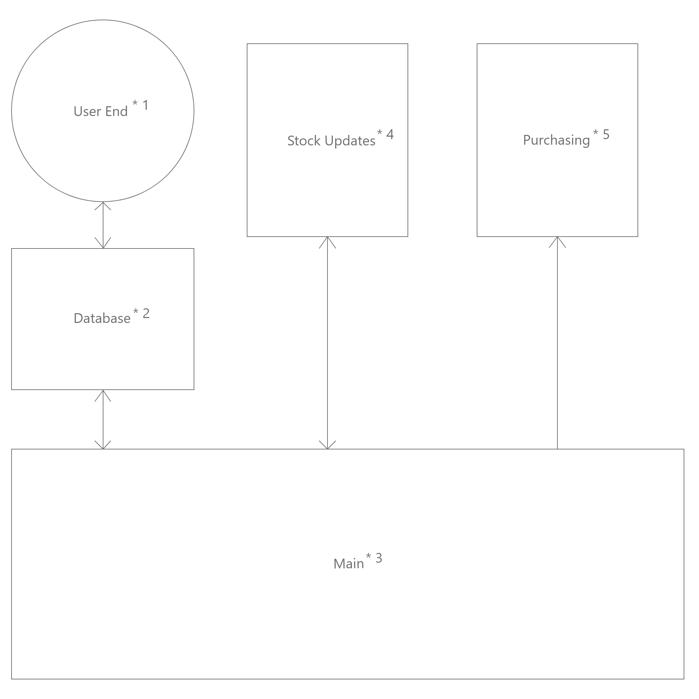

# NightBeat
This is a program designed to allow for the clothing equivalent of a stocks call. It helps the user automate buying retail clothing that appreciates heavily in value over the course of months, weeks, or even days.

# General Diagram

## *_**The above shows the order in which we will work through the program**_*
1. User End
2. Databases
3. Main
4. Webhooks / pinging shop stocks
5. Purchasing selected stock

# Concerns
- Security
  - Sensitive data that requires heavy encryption as well as secure transfer
- Model
  - Multiple ways of dealing with data some with fewer security concerns and some with better performance
- Databases
  - Database structuring will be a large hurdle
  
# Technologies 
1. React
2. Gatsby
3. graphQL
3. MySQL
4. NodeJS

# Getting Started
TODO
# Build and Test
TODO
 
### Just for me
If you want to learn more about creating good readme files then refer the following [guidelines](https://www.visualstudio.com/en-us/docs/git/create-a-readme).
